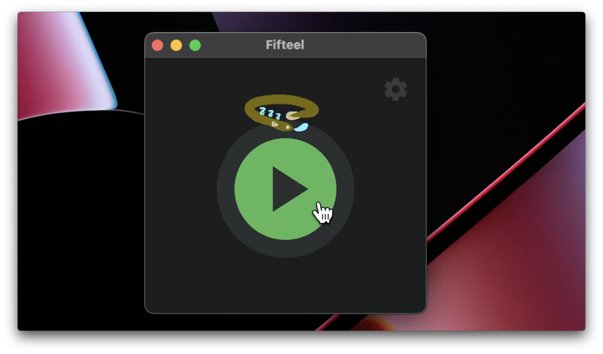

# fifteel


## 〇〇xTech
15分xTech


## 紹介動画
こちらからどうぞ! [https://drive.google.com/file/d/1HXnRV8CBgjxmWI3GqmVFQJFyWo6fYK84/view?usp=sharing](https://drive.google.com/file/d/1HXnRV8CBgjxmWI3GqmVFQJFyWo6fYK84/view?usp=sharing)

## ギャラリー
アプリ画面（動画は[こちら](https://github.com/jphacks/NG_2308/assets/65986407/d0afd900-8de4-4d59-86e4-e9645ea036ea)）


通知の様子(動画は[こちら]([resources/docs/notify_demo1.mp4](https://github.com/jphacks/NG_2308/assets/65986407/fef62599-0fae-499d-b03c-57bb61cbd32e)))


## 製品概要
### 背景(製品開発のきっかけ、課題等）
「15分調べたり考えたりしても解決しなかったら人に聞きましょう」

IT系の世界ではよく知られている15分ルール．何か問題に躓いた時，検索や試行錯誤，言語モデルに相談することもあるでしょう．しかしこれらに没頭するがあまり，時間を忘れてしまうことはありませんか?

「実力が現れるのは15分間．それ以上は時間の浪費になる．それより先に人に聞くと，人の時間を奪うことになる．」とも言われています．15分ルールに従うことは，生産性を大きく向上させてくれます．しかし，毎回タイマーを設定するのは煩わしかったり，忘れてしまうこともあるでしょう．そんなお悩みを解決します．

### 製品説明（具体的な製品の説明）
### 特長
#### 1. 特長1
必要な操作は，アプリの起動だけ

観測したユーザーの検索活動に基づき，同じ問題で15分悩んでいる様子を検出すると，自動でお知らせします．タイマーなどを設定する必要はなく，あなたのコーディングを見守ってくれます．
#### 2. 特長2
独自の判定システム

悩んでいる問題の移り変わりは，既存のLLM(大規模言語モデル)に独自の改良を施したものを使用．ChatGPT等の外部サービスに依存することはなく，情報流出のおそれはありません．
#### 3. 特長3
通知の仕方もあなた好みに

「音を鳴らしてほしい」「音は鳴らさず，ポップアップ通知だけにしてほしい」など，通知のスタイルにもこだわりや要望はあることでしょう．それらのスタイルに合わせてカスタムできます．

### 解決出来ること
自然に15分ルールに従うことができるため，開発者の無駄な時間の浪費を解決します．
### 今後の展望
抱えている問題の移り変わりの検出性能の向上や，更なる開発者の健康サポートなどを進めます．
### 注力したこと（こだわり等）
* 独自の言語モデルの開発
* 通知のカスタマイズ性
* ドキュメント駆動，Issue駆動による開発効率向上

## 開発技術
### 活用した技術
#### API・データ
ローカルの動作で完結しており，外部サービスに依存していません

#### フレームワーク・ライブラリ・モジュール
* 問題切り替わり検出
  * pytorch
  * fastapi
* UI
  * flet
* ブラウザ活動観察
  * chrome拡張

#### 対応環境
* OS: Mac/Linuxに対応
* 別途，chrome拡張が動作するブラウザが必要

### 独自技術
#### ハッカソンで開発した独自機能・技術
* 検索ワードと訪問サイトタイトルに基づく，ユーザーが解決したい問題の切り替わりの判定
* 我らがマスコットキャラクター・eelくん
* FastAPIにより呼び出し可能なcolab上基盤

#### 製品に取り入れた研究内容（データ・ソフトウェアなど）（※アカデミック部門の場合のみ提出必須）
* 検索ワードと訪問サイトタイトルに基づく，ユーザーが解決したい問題の切り替わりの判定

## 利用方法
- chrome拡張のインストール
  - 拡張機能の管理ページでデベロッパーモードにする
  - 「パッケージ化されていない拡張機能を読み込む」選択し、`src/chrome_extension`以下を拡張機能として読み込む
- ローカルのpython環境を用意する
  - python3.9.1を導入．
  - `$ pip install --upgrade pip`を実行
  - `$ pip install -r requirements.txt`を実行
- fastAPIサーバーの起動
  - Macの場合，以下の対応が必要．
    - `PYTHON_LIBRARY_PATH/site-packages/plyer/platforms/macosx/notification.py`を開いて，以下に置き換え．
```python
'''
Module of MacOS API for plyer.notification.
'''

from plyer.facades import Notification

import os

class OSXNotification(Notification):
    '''
    Implementation of MacOS notification API.
    '''

    def _notify(self, **kwargs):
        title = kwargs.get('title', '')
        message = kwargs.get('message', '')
        app_name = kwargs.get('app_name', '')
        sound_name = 'default'
        # app_icon, timeout, ticker are not supported (yet)

        title_text = f'with title "{title}"' if title != '' else ''
        subtitle_text = f'subtitle "{app_name}"' if app_name != '' else ''
        soundname_text = f'sound name "{sound_name}"'

        notification_text = f'display notification "{message}" {title_text} {subtitle_text} {soundname_text}'
        os.system(f"osascript -e '{notification_text}'")

def instance():
    '''
    Instance for facade proxy.
    '''
    return OSXNotification()
```
  - `src/engine` へ移動
  - `$ uvicorn server:app --host 0.0.0.0 --reload --port 8000`を実行
- LLMサーバーの起動
  -  google colabを利用する方法
     -  `src/llm/llm-server.ipynb`をgoogle colabにコピー
     -  ランタイムをGPUマシン(V100を推奨)に変更する
     -  全てのセルを上から順に実行
     -  最後のセルの出力から`https://xxx-xx-xx-xx-xx.ngrok.io`という形式のアドレスをコピー
     -  `src/engine/.env`ファイルを作成し、`LLM_SERVER=`の後に続けてコピーしたアドレスを書き加える
  -  GPUマシンを利用する方法(VRAM 16G以上推奨)
     - `src/llm` へ移動
     - `$ uvicorn server:app --host 0.0.0.0 --reload --port 8001`を実行
     -  `src/engine/.env.sample`をコピーして`src/engine/.env`ファイルを作成する
- ui.pyの起動
  - `src/engine`ディレクトリで `$ python ui.py` で起動
- notify.pyの起動
  - `src/engine`ディレクトリで `$ python notify.py` で起動

## 今後の展望

- makefileなどによる，セットアップの自動化
- 関連研究の更なる調査や，fine-tuningやプロンプト改良などによるLLMによる判定機構の性能向上
- 通知までの時間やカスタム音声の再生など，カスタマイズ性の向上


## 使用素材
- アラート音: https://mobunikomiudon.com/sound/se-system/
- eelくん 音声: https://voicevox.hiroshiba.jp/product/manbetsu_hanamaru/
- 説明映像のBGM: https://dova-s.jp/bgm/play13002.html
