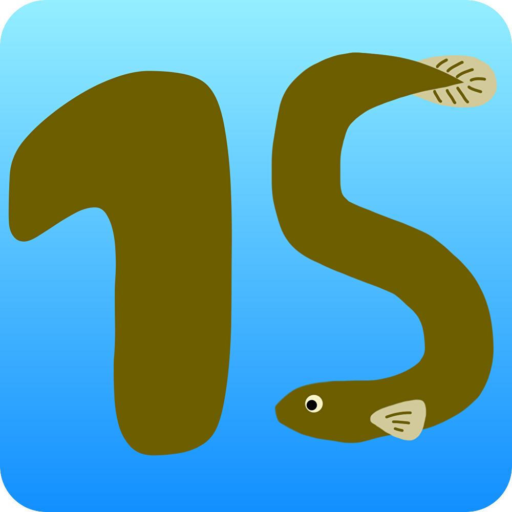

# fifteel




## 〇〇xTech
15分xTech


## 紹介動画(まだ)
[](https://www.youtube.com/watch?v=yYRQEdfGjEg)

## 製品概要
### 背景(製品開発のきっかけ、課題等）
「15分調べたり考えたりしても解決しなかったら人に聞きましょう」

IT系の世界ではよく知られている15分ルール．何か問題に躓いた時，検索や試行錯誤，言語モデルに相談することもあるでしょう．しかしこれらに没頭するがあまり，時間を忘れてしまうことはありませんか?

「実力が現れるのは15分間．それ以上は時間の浪費になる．それより先に人に聞くと，人の時間を奪うことになる．」とも言われています．15分ルールに従うことは，生産性を大きく向上させてくれます．しかし，毎回タイマーを設定するのは煩わしかったり，忘れてしまうこともあるでしょう．そんなお悩みを解決します．

### 製品説明（具体的な製品の説明）
### 特長
#### 1. 特長1
必要な操作は，アプリの起動だけ

観測したユーザーの活動に基づき，同じ問題で15分悩んでいる様子を検出すると，自動でお知らせします．タイマーなどを設定する必要はなく，あなたのコーディングを見守ってくれます．
#### 2. 特長2
独自の判定システム

悩んでいる問題の移り変わりは，既存のLLM(大規模言語モデル)に独自の改良を施したものを使用．ChatGPT等の外部サービスに依存することはなく，情報流出のおそれはありません．
#### 3. 特長3
通知の仕方もあなた好みに

「音を鳴らしてほしい」「音は鳴らさず，ポップアップ通知だけにしてほしい」など，通知のスタイルにもこだわりや要望はあることでしょう．それらのスタイルに合わせてカスタムできます．

### 解決出来ること
自然に15分ルールに従うことができるため，開発者の無駄な時間の浪費を解決します．
### 今後の展望
抱えている問題の移り変わりの検出性能の向上や，更なる開発者の健康サポートなどを進めます．
### 注力したこと（こだわり等）
* 独自の言語モデルの開発
* 通知のカスタマイズ性
* ドキュメント駆動，Issue駆動による開発効率向上

## 開発技術
### 活用した技術
#### API・データ
ローカルの動作で完結しており，外部サービスに依存していません

#### フレームワーク・ライブラリ・モジュール
* 問題切り替わり検出
  * pytorch
  * fastapi
* UI
  * flet
* ブラウザ活動観察
  * chrome拡張

#### デバイス
* Mac/Windows/Linuxに対応
  * chrome拡張が動作するブラウザが必要

### 独自技術
#### ハッカソンで開発した独自機能・技術
* 独自で開発したものの内容をこちらに記載してください
* 特に力を入れた部分をファイルリンク、またはcommit_idを記載してください。

#### 製品に取り入れた研究内容（データ・ソフトウェアなど）（※アカデミック部門の場合のみ提出必須）
* 検索ワードと訪問サイトタイトルに基づく，ユーザーが解決したい問題の切り替わりの判定

## 音声素材
https://mobunikomiudon.com/sound/se-system/

## 利用方法
- chrome拡張のインストール
  - 拡張機能の管理ページでデベロッパーモードにする
  - 「パッケージ化されていない拡張機能を読み込む」選択し、`..\NG_2308\src\chrome_extension`以下を拡張機能として読み込む
- ローカルのpython環境を用意する
  - `pyenv`のインストール
  - `pyenv install 3.9.1`を実行
  - `python -m venv venv`を実行
  - `pip install --upgrade pip`を実行
  - (windowsの場合は`.\requirements.txt`の最後の行を削除)
  - `pip install -r .\requirements.txt`を実行
- fastAPIサーバーの起動
  - Macの場合，以下の対応が必要．
    - `venv/lib/python3.11/site-packages/plyer/platforms/macosx/notification.py`を開いて，以下に置き換え．
```python
'''
Module of MacOS API for plyer.notification.
'''

from plyer.facades import Notification

import os

class OSXNotification(Notification):
    '''
    Implementation of MacOS notification API.
    '''

    def _notify(self, **kwargs):
        title = kwargs.get('title', '')
        message = kwargs.get('message', '')
        app_name = kwargs.get('app_name', '')
        sound_name = 'default'
        # app_icon, timeout, ticker are not supported (yet)

        title_text = f'with title "{title}"' if title != '' else ''
        subtitle_text = f'subtitle "{app_name}"' if app_name != '' else ''
        soundname_text = f'sound name "{sound_name}"'

        notification_text = f'display notification "{message}" {title_text} {subtitle_text} {soundname_text}'
        os.system(f"osascript -e '{notification_text}'")

def instance():
    '''
    Instance for facade proxy.
    '''
    return OSXNotification()
```
  - `cd ..\NG_2308\src\engine`を実行
  - `uvicorn server:app --host 0.0.0.0 --reload --port 8000`を実行
- LLMサーバーの起動
  -  google colabを利用する方法
     -  `..\NG_2308\src\llm\llm-server.ipynb`をgoogle colabにコピー
     -  ランタイムを`T4 GPU`に変更する
     -  全てのセルを上から順に実行
     -  最後のセルの出力から`https://xxx-xx-xx-xx-xx.ngrok.io`という形式のアドレスをコピー
     -  `src/engine/.env`ファイルを作成し、`LLM_SERVER=`の後に続けてコピーしたアドレスを書き加える
- ui.pyの起動
  - engineディレクトリで python ui.py で起動

- 実行完了!!

  -  ローカルのマシンを利用する方法(VRAM 16G以上推奨)
     - 
     - 