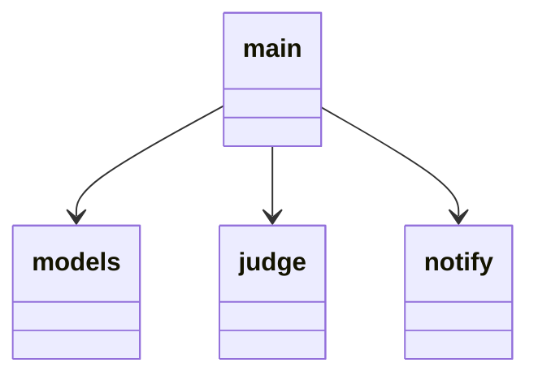

# engine

## server.py
chromeからのリクエストの受け取りと，1分ごとにログファイルを見て通知を送るか判定する．
8000番ポートで起動．

- `on_page_open(req: OnPageOpen)`
  - 引数
    - OnPageOpen
    - postを受け付ける(`@app.post("/on_page_open")`)
  - 返り値
    - fastapi.responses.JSONResponse
  - ページの内容を受け取って，悩み続けてるか判定をする
- `on_google_search(req: OnGoogleSearch)`
  - 引数
    - OnGoogleSearch
    - postを受け付ける(`@app.post("/on_google_search")`)
  - 返り値
    - fastapi.responses.JSONResponse
  - 検索ワードを受け取って，悩み続けてるか判定をする

## notify.py
通知を行う機能を担う．

- `notify(msg: str="そろそろ人に聞いてみてはいかが?")`
  - 引数
    - str
    - 表示するor再生するメッセージ
  - 返り値
    - なし

## judge.py
LLMとやり取りをして，ログファイルに時刻と通知を送るべきかを記載する．

## models.py
apiが受け取るデータのモデルの定義をする．以下でOK
```python
from pydantic import BaseModel


class OnPageOpen(BaseModel):
    content: str


class OnGoogleSearch(BaseModel):
    query: str
```

## ファイル間の依存関係

# LLM

## llm.py
言語モデルの本体．

- class Agent
  - `on_user_action()`

## server.py
fastapiによるサーバー．
8001番ポートで起動．
クライアントごとにAgentを辞書で保持．
クライアントの識別には，uuidを発行する．空の文字列が渡された時には，uuidを新規発行する．

- `on_action(req: OnAction)`
  - 引数
    - OnAction
    - postを受け付ける(`@app.post("/on_action")`)
  - 返り値
    - fastapi.responses.JSONResponse
  - 同じ問題で悩んでいるかどうか判定した結果を返す．`{"is_same_topic": True}`の形式．

## models.py
apiが受け取るデータのモデルの定義をする．以下でOK
```python
from pydantic import BaseModel


class OnAction(BaseModel):
    client_uuid: str
    search_word: str
    page_content: str
```

# メモ
