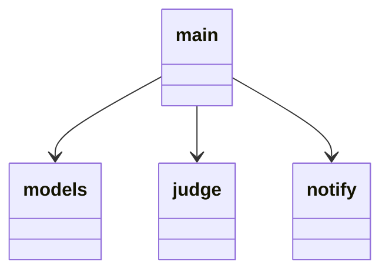
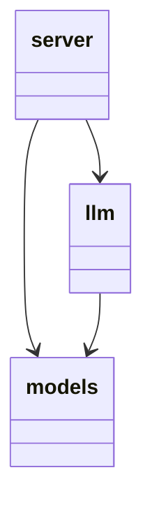

# engine

## ui.py

UIの表示と，裏の設定ファイルの更新を行う．

起動時に，
- src/engine/varディレクトリがあるか判定する．なければ作成．
- src/engine/var/settings.yamlがあるか判定する．なければ作成．
  - なかったら，`is_running: false, is_play_sound: true`でyamlを作る．
  - あったら，`is_running: false`に上書きする．
アプリ実行中，開始ボタンの操作や設定の変更があった場合，↑のsetting.yamlの値を書き換える．

## server.py
chromeからのリクエストの受け取りと，1分ごとにログファイルを見て通知を送るか判定する．
8000番ポートで起動．

- `on_page_open(req: OnPageOpen)`
  - 引数
    - OnPageOpen
    - postを受け付ける(`@app.post("/on_page_open")`)
  - 返り値
    - fastapi.responses.JSONResponse
  - ページの内容を受け取って，悩み続けてるか判定をする
- `on_google_search(req: OnGoogleSearch)`
  - 引数
    - OnGoogleSearch
    - postを受け付ける(`@app.post("/on_google_search")`)
  - 返り値
    - fastapi.responses.JSONResponse
  - 検索ワードを受け取って，悩み続けてるか判定をする

## notify.py
通知を行う機能を担う．

- `notify(msg: str="そろそろ人に聞いてみてはいかが?")`
  - 引数
    - str
    - 表示するor再生するメッセージ
  - 返り値
    - なし
- `notify_callback()`
  - 引数
    - なし
  - 返り値
    - なし
  - 30秒ごとに実装される関数．
  - /src/engine/var/judge.csvと/src/engine/var/settings.yamlを見て，通知を行うか判定．
  - 通知すると判定したら，設定に応じてポップアップ通知(`do_popup_notify()`)と音声の通知(`play_sound()`)を実行．
    - とりあえずは，デフォルトの音声のみ対応なので，`play_sound(get_default_wav_path())`でOK．
    - WANTの実装で，音声のカスタムをできるようにする場合は，設定ファイルを読みに行って，そのファイルを再生，とする必要あり．

## judge.py
LLMとやり取りをして，ログファイルに時刻と通知を送るべきかを記載する．
- `judge()`
  - 引数
    - client_uuid: str
      - クライアントのuuid
    - search_word: str
      - 検索ワード
    - content: str
      - 訪れたページの内容
  - 返り値
    - なし
  - 引数で受け取った情報を全部，llmのサーバーにPOSTで送る．
  - POST先は，src/engine/.envの中の`LLM_SERVER`の値を読み取って，そのアドレスに，"/on_action"を付け加えたもの．
  - POSTの結果を受け取って，`append_log()`を呼ぶ
- `append_log()`
  - 引数
    - timestamp: int
      - unix時間のタイムスタンプ
    - search_word: str
      - 検索ワード
    - content: str
      - 訪れたページの内容
    - is_same_topic: bool
      - 同じトピックが続いていればTrue
  - 返り値
    - なし
  - src/engine/varディレクトリがあるか判定する．なければ作成．
  - src/engine/var/judge.csv のファイルがあるか判定する．なければ作成．
  - 引数の4つを，半角コンマ区切りで保存する．この時，search_wordsとcontentに半角コンマが含まれていたら，全角コンマに置き換える．


## models.py
apiが受け取るデータのモデルの定義をする．以下でOK
```python
from pydantic import BaseModel


class OnPageOpen(BaseModel):
    content: str


class OnGoogleSearch(BaseModel):
    query: str
```

## ファイル間の依存関係

# LLM

## llm.py
言語モデルの本体．

- class Agent
  - `__init__()`
    - 引数: なし
    - 返り値: なし
    - 言語モデルをインスタンス化して，プロパティ`model`に格納する．多分結構時間かかる(3分くらい?)．
  - `on_user_action()`
    - 引数: action(`OnAction`)
    - 返り値: bool
      - True: これまでと同じ話題で検索中
      - False: 話題が直前と切り替わった
    - 内部で，self.modelに対して文章を与える．その出力に応じて返り値を返す．もし内部でエラーが起きたら，強制的にFalseを返す．(tryの例外処理で．)

## server.py
fastapiによるサーバー．
8001番ポートで起動．
クライアントごとにAgentを辞書で保持．
クライアントの識別には，uuidを発行する．空の文字列が渡された時には，uuidを新規発行する．

`agents = {"215abb4f-47a8-8774-70b6-4d7fa96f494c": agent_instance}`のような形になる．
`agents`はグローバルに宣言する．

- `on_action(req: OnAction)`
  - 引数
    - OnAction
    - postを受け付ける(`@app.post("/on_action")`)
  - 返り値
    - fastapi.responses.JSONResponse
  - 同じ問題で悩んでいるかどうか判定した結果を返す．`{"is_same_topic": True}`の形式．結果は，現在のuuidのクライアントに対応したagentの`on_user_action()`を呼ぶ．

## models.py
apiが受け取るデータのモデルの定義をする．以下でOK
```python
from pydantic import BaseModel


class OnAction(BaseModel):
    client_uuid: str
    search_word: str
    page_content: str
```

## ファイル間の依存関係


# メモ
